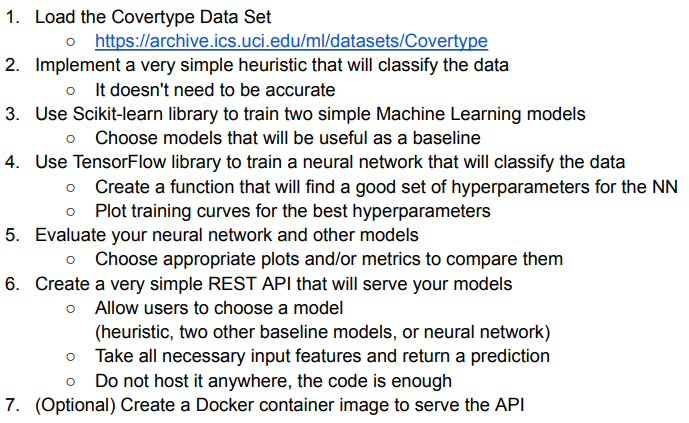

# OpenX_Machine_Learning_Intern_2023



# OPTIONAL TASK

Build the Docker image by running the following command in your project directory:

```sh
docker build -t myapp .
```

Run the Docker container by running the following command:

```sh
# docker run -p 5000:5000 -v /path/to/models:/app/models myapp
docker run -p 5000:5000 -v . :/app/models myapp
```
